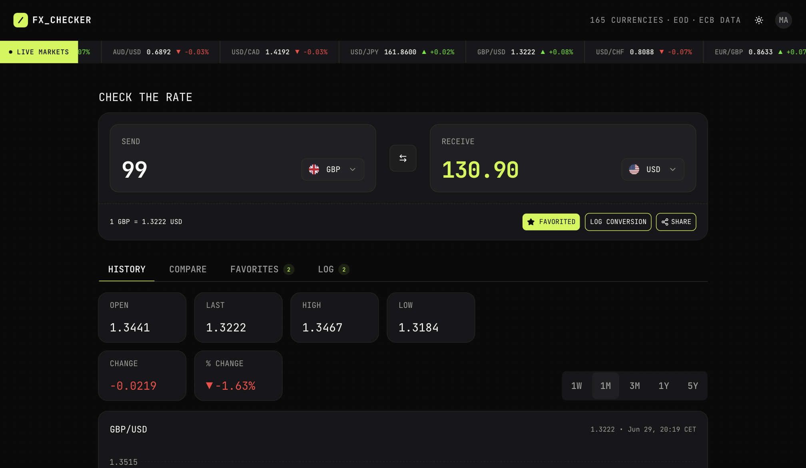
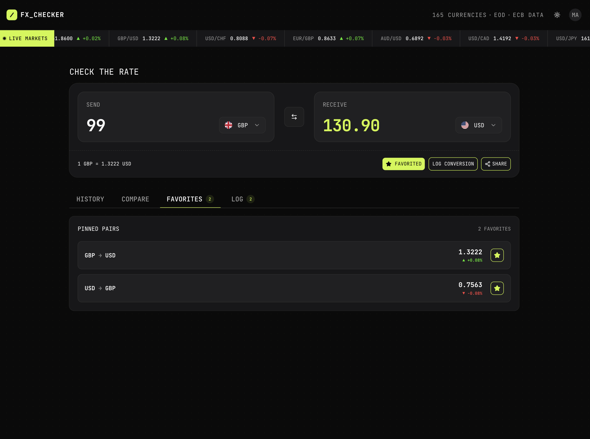
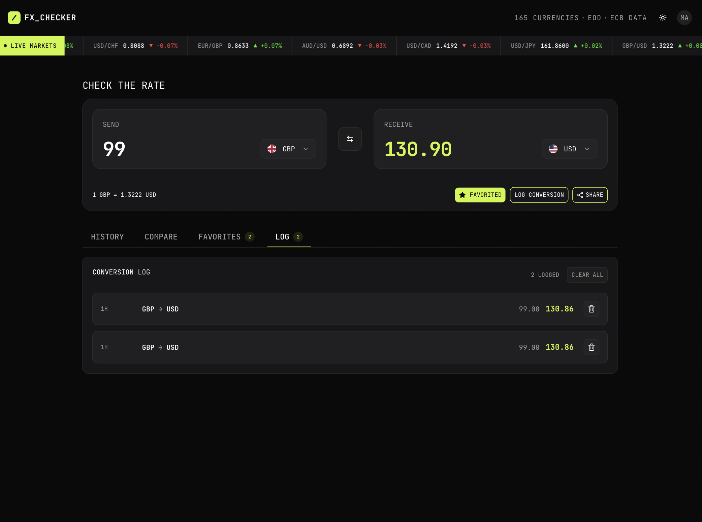
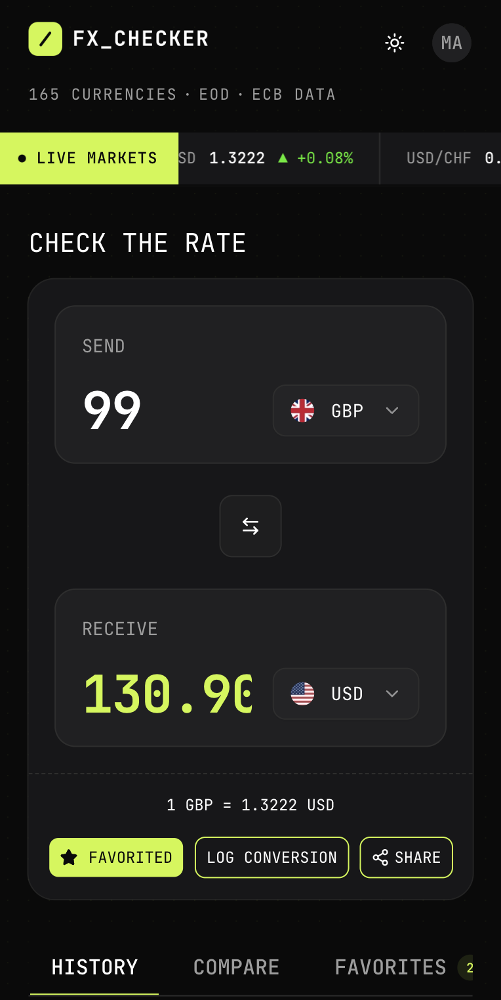

# Foreign Exchange Checker

A responsive, and high-performance Foreign Exchange (FX) Checker application built using **React**, **React Router v7 (SSR)**, and **Tailwind CSS**. It incorporates real-time rates conversion, dynamic historical charts, multi-currency comparison boards, and persistent cloud-based user data using Appwrite.

---

## 🚀 Key Features

* **Real-time FX Converter**: Instant currency conversions with live ticker data, fully integrated with URL search parameters for sharing and bookmarking.
* **Interactive Charting**: Historical rate fluctuation tracking over various timeframes (1W to 5Y) plotted with Recharts.
* **Comparison Dashboard**: Check a base currency against multiple quote currencies simultaneously inside a performance-optimized list.
* **Persistent Favorites & Logs**: Keep track of pinned pairs and conversion logs saved directly in an Appwrite database, synced with React Query.
* **Intent-Based Auth modal**: Protected actions (like logging or favoriting) automatically redirect unauthenticated users to a secure sign-in portal and execute the initial action seamlessly upon login.
* **Rich Aesthetics**: Premium UI design system with curated OKLCH color palettes, smooth hover effects, micro-animations, and full dark-mode support.

---

## 📸 Screenshots

| Historical Exchange Rate Charts | Pinned Favorite Currency Pairs |
| :---: | :---: |
|  <br> *Dynamic historical charting panel with custom timeframes* |  <br> *Live-updated favorites dashboard and star toggles* |

| Conversion Logs History | Responsive Mobile Layout |
| :---: | :---: |
|  <br> *Stored history log with deletion and restore options* |  <br> *Adaptive mobile layouts with custom scroll behaviors* |

---

## 🛠️ Architecture & Tech Stack

* **Frontend Framework**: [React Router v7](https://reactrouter.com/) (running in Server-Side Rendering mode).
* **State Management**:
  * [TanStack React Query v5](https://tanstack.com/query/latest) for server cache synchronization and database states.
  * [Redux Toolkit](https://redux-toolkit.js.org/) for local, synchronous client UI states (such as active conversion field selections).
* **Database & Auth**: [Appwrite Client SDK](https://appwrite.io/) using `TablesDB` collections.
* **UI Components**: [shadcn/ui](https://ui.shadcn.com/) atomic base primitives built on Radix UI and Base UI (customized directly for layout cards, forms, and navigation).
* **Styling**: [Tailwind CSS v4](https://tailwindcss.com/) with native CSS variable configuration.
* **Data Visualizations**: [Recharts](https://recharts.org/) for area chart indicators.
* **Code Quality**: [Biome](https://biomejs.dev/) for ultra-fast linting and formatting.

---

## ⚙️ Prerequisites & Setup

### 1. Requirements
* **Node.js**: `v18.x` or higher
* **npm**: `v9.x` or higher

### 2. Environment Variables
Create a `.env` file in the root directory and specify the following variables:

```env
VITE_APPWRITE_ENDPOINT=https://cloud.appwrite.io/v1
VITE_APPWRITE_PROJECT_ID=your_project_id
```

### 3. Installation
Install the project dependencies using `npm`:
```bash
npm install
```

---

## 💻 Available Scripts

* **`npm run dev`**: Starts the Vite local development server.
* **`npm run build`**: Compiles both client and server build assets for production.
* **`npm run start`**: Launches the local production server from the build output.
* **`npm run typecheck`**: Runs TypeScript compiler checking and React Router typegen validation.

---

## 📂 Project Documentation

For a detailed breakdown of the file structure, database collection design, and code patterns, refer to the [Project Documentation](/docs/project-overview.md).
