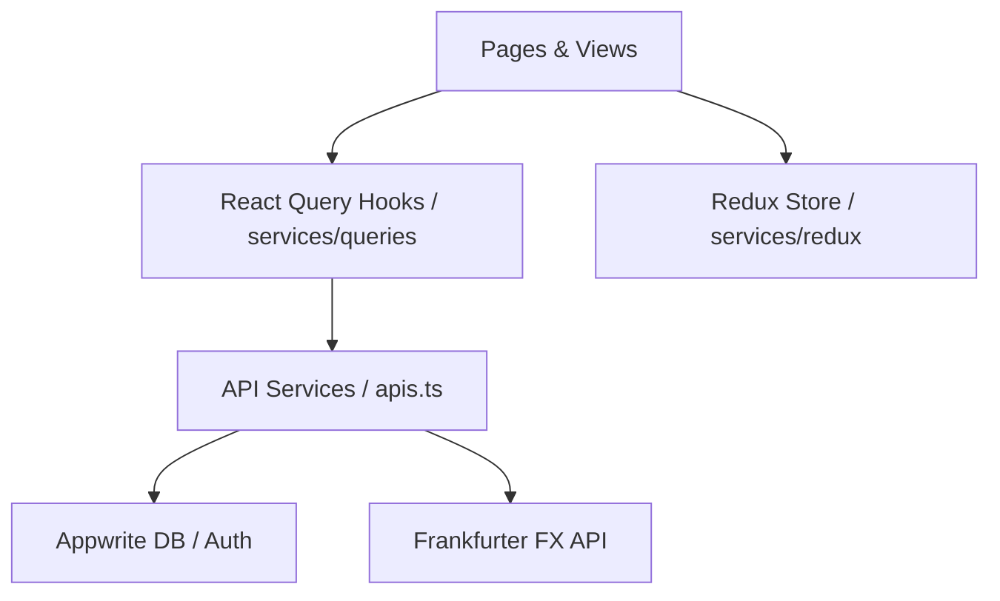

# Foreign Exchange Checker - Project Documentation

A professional, high-performance foreign exchange (FX) rates checker application built with React, React Router v7, and Tailwind CSS. The app features real-time converter forms, dynamic historical charting, multi-select comparison boards, and persistent user-level favorites and conversion logs backed by Appwrite.

---

## 1. Project Architecture Overview

The project uses a structured model-view-controller styled pattern to handle state, layout presentation, and remote API calls:



---

## 2. Directory Structure

```filename
├── app/
│   ├── assets/                 # SVGs and static media resources
│   ├── components/             # Reusable UI component elements
│   │   ├── custom/             # Domain-specific components (e.g. FlagImage, IconButton)
│   │   ├── forms/              # Controlled form fields and inputs
│   │   └── ui/                 # Atomic Shadcn base components
│   ├── helpers/                # Formatters, calculations, and date helpers
│   ├── lib/                    # SDK clients and third-party initializations
│   ├── providers/              # Global React Context providers (Auth, Theme, Redux, React Query)
│   ├── routes/                 # Routing page views
│   │   ├── auth/               # Login & registration views
│   │   ├── compare/            # Base currency to multiple quote rates board
│   │   ├── favorites/          # Pinned/saved currency pairs board
│   │   ├── history/            # Historical charting and graph panel
│   │   ├── home/               # Navigation layout container
│   │   └── logs/               # Saved conversion history logs
│   └── services/               # Data layer & state managers
│       ├── queries/            # React Query hooks (FX, Auth, Favorites, Logs)
│       └── redux/              # Global active converter UI state
└── docs/                       # Project documentation
```

---

## 3. Pages & Features

### Home Layout & Navigation (`app/routes/home/`)
* **[index.tsx](../app/routes/home/index.tsx)**: The main application container rendering the top header navigation layout (containing logo, theme switcher, and user options) and tab panel navigation. Renders real-time counters representing active favorites and log lists.
* **Live Ticker**: Renders an auto-scrolling ticker bar showing spot changes for major currency pairs.
* **Converter Form**: Core converter widget that synchronizes inputs with both Redux slices and URL search parameters for link preservation. Includes favoriting options and conversion logger triggers.

### History Page (`app/routes/history/`)
* Displays conversion results relative to selected periods (1W, 1M, 3M, 1Y, 5Y).
* Integrates **Recharts** area charts to plot exchange rates over historical timeframes, showing daily range thresholds and formatting.

### Compare Page (`app/routes/compare/`)
* Allows users to select a base currency and inspect exchange values across all other quotes simultaneously in a virtualized list.
* Offers inline star toggles to add quote pairings directly to favorites.

### Pinned Favorites (`app/routes/favorites/`)
* Lists user-pinned favorite pairs.
* Fetches live prices for each pair from the server on-demand to guarantee that exchange metrics are accurate and never stale.

### History Logs (`app/routes/logs/`)
* Lists conversion transactions completed by the user.
* Allows individual item deletion, history clearing, and restoring conversion context directly to the active converter widget.

---

## 4. Authentication & Security

* Authentications are managed through Appwrite's client `Account` service.
* Users can sign in or register through modal dialog overrides or specialized login/registration routing folders.
* **Protected Operations**: Sensitive operations (e.g. favoriting or logging conversions) leverage the authentication context. If an unauthenticated user attempts a protected action, they are redirected to the Login page with a background routing transition context to preserve their action intent.

---

## 5. Query Services Layer (`app/services/queries/`)

All database and authentication tasks use React Query to manage server caching, network synchronization, and optimistic UI transitions:

### Auth Queries (`auth/`)
* Handles user registration, login credentials, and session checks. Invalidation updates the global query keys automatically.

### FX Queries (`fx/`)
* Handles exchange rate lookups, historical records, and currency names. Requests are throttled and cached to prevent Frankfurter API rate-limiting.

### Favorites (`favorites/`) & Logs (`logs/`)
* Interacts with Appwrite's database service (`TablesDB`) under `6a4265e4001112d6fa4a` database ID.
* Queries are mapped to their respective collections (`favorites` and `logs`), scoped dynamically to the active `userId`, and sorted chronologically.
